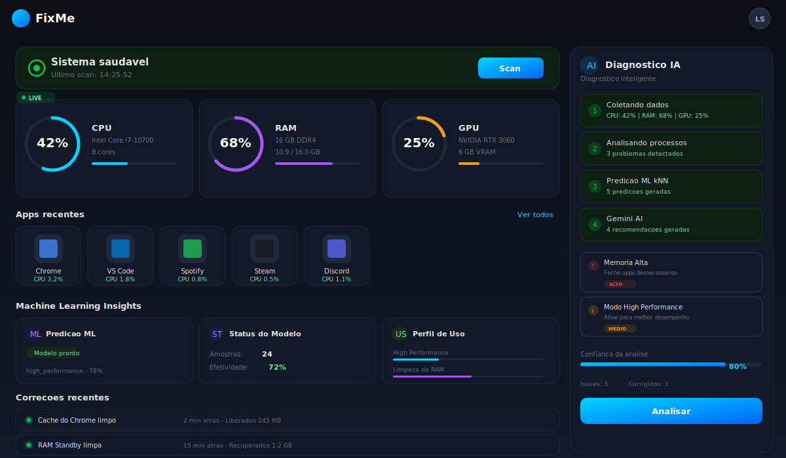
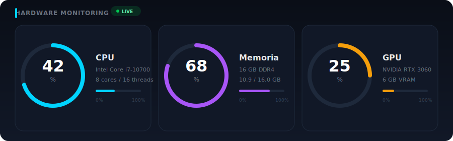
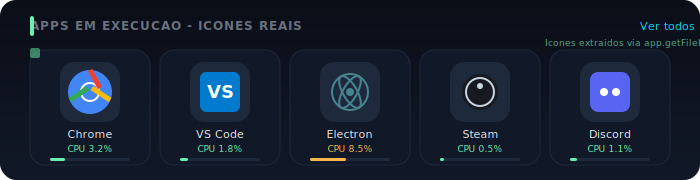
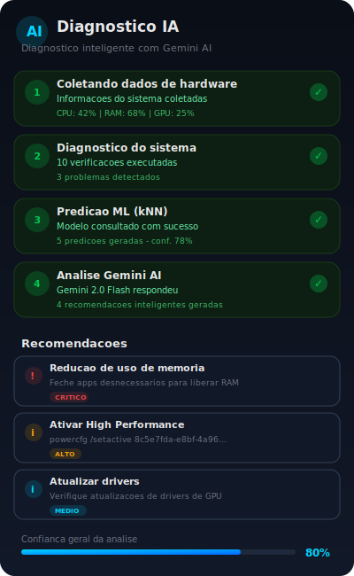
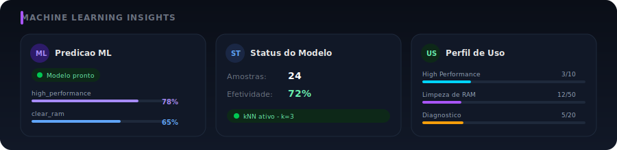
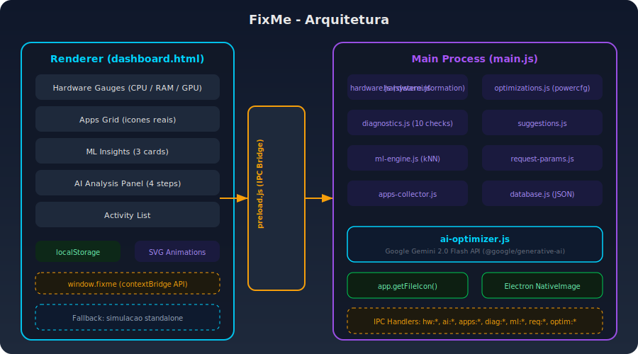

<p align="center">
  
</p>

<h1 align="center">FixMe</h1>

<p align="center">
  <strong>Ferramenta de otimizacao desktop para Windows 10/11 com foco em jogos</strong><br/>
  Electron + Gemini AI + Machine Learning (kNN) + Monitoramento em tempo real
</p>

<p align="center">
  
  
  
  
  
</p>

---

## Visao Geral

O **FixMe** e uma aplicacao desktop construida com Electron que monitora, diagnostica e otimiza o desempenho do seu PC Windows em tempo real. Ele combina coleta de dados de hardware, diagnosticos automatizados, Machine Learning preditivo e inteligencia artificial (Google Gemini) para fornecer recomendacoes personalizadas.

---

## Dashboard

<p align="center">
  
</p>

O dashboard apresenta uma interface moderna com tema escuro, exibindo dados em tempo real:

- **Gauges de Hardware** - CPU, RAM e GPU com gauge rings SVG animados
- **Apps em Execucao** - Grid com icones reais dos processos extraidos via `app.getFileIcon()`
- **ML Insights** - 3 cards com predicoes, status do modelo e perfil de uso
- **Painel de Analise IA** - Sidebar com pipeline de 4 etapas e recomendacoes Gemini
- **Correcoes Recentes** - Timeline de otimizacoes aplicadas

---

## Funcionalidades

### 1. Monitoramento de Hardware em Tempo Real

<p align="center">
  
</p>

| Metrica | Detalhes |
|---------|----------|
| **CPU** | Uso atual (%), modelo, cores/threads, barra de uso colorida |
| **RAM** | Uso atual (%), total/usado em GB, barra de uso colorida |
| **GPU** | Uso atual (%), modelo, VRAM, barra de uso colorida |

- Monitoramento via biblioteca `systeminformation`
- Atualizacao automatica a cada 2 segundos via IPC
- Gauge rings SVG com animacao suave de transicao
- Indicador **LIVE** com pulse animation
- Cores adaptativas: verde (<60%), amarelo (60-80%), vermelho (>80%)

---

### 2. Apps em Execucao com Icones Reais

<p align="center">
  
</p>

- Coleta processos em execucao via `systeminformation.processes()`
- Extrai icones reais dos executaveis `.exe` usando `app.getFileIcon()` do Electron
- Converte icones para data URL (base64 PNG) via `NativeImage.toDataURL()`
- Agrupa processos duplicados e soma CPU/RAM
- Exibe top 12 apps ordenados por uso de CPU
- Barra de uso com cor adaptativa (verde/amarelo/vermelho)
- Atualizacao automatica a cada 30 segundos
- Tooltip com caminho completo e metricas detalhadas

---

### 3. Analise de IA Completa (Gemini 2.0 Flash)

<p align="center">
  
</p>

Pipeline de 4 etapas com progresso em tempo real:

| Etapa | Descricao | Modulo |
|-------|-----------|--------|
| **1. Coleta de Hardware** | Dados de CPU, RAM, GPU, processos | `hardware.js` |
| **2. Diagnostico do Sistema** | 10 verificacoes automatizadas | `diagnostics.js` |
| **3. Predicao ML** | Algoritmo kNN com dados historicos | `ml-engine.js` |
| **4. Gemini AI** | Recomendacoes inteligentes personalizadas | `ai-optimizer.js` |

**Detalhes da integracao IA:**
- Modelo: `gemini-2.0-flash` via `@google/generative-ai` SDK
- Prompt estruturado com perfil de hardware, estado atual e historico
- Resposta em JSON com recomendacoes priorizadas (critico/alto/medio/baixo)
- Cada recomendacao inclui: titulo, descricao, comando e prioridade
- Barra de confianca com metrica de issues detectadas vs corrigidas

---

### 4. Machine Learning Engine (kNN)

<p align="center">
  
</p>

| Funcionalidade | Descricao |
|---------------|-----------|
| **Algoritmo** | k-Nearest Neighbors (k=3) com distancia euclidiana normalizada |
| **Features** | CPU%, RAM%, GPU%, contagem de processos |
| **Treinamento** | Automatico apos cada otimizacao executada |
| **Predicao** | Sugere melhor otimizacao baseada no estado atual do hardware |
| **Persistencia** | `localStorage` (browser) + JSON database (Electron) |
| **Cards** | Predicao ML, Status do Modelo (amostras/efetividade), Perfil de Uso |

**3 Cards do ML Insights:**
1. **Predicao ML** - Mostra predicoes com tipo, confianca e barra de score
2. **Status do Modelo** - Amostras treinadas e efetividade media
3. **Perfil de Uso** - Rate limiting visual por tipo de operacao

---

### 5. Diagnostico do Sistema (10 Verificacoes)

O modulo de diagnostico executa 10 verificacoes automatizadas:

| # | Verificacao | Severidade | Detalhes |
|---|-----------|------------|----------|
| 1 | **Windows Updates** | HIGH | Verifica instalacoes recentes de atualizacoes |
| 2 | **Espaco em Disco** | CRITICAL/HIGH | Alerta >85% ou >95% de uso |
| 3 | **Drivers** | MEDIUM | Detecta dispositivos com problemas no Device Manager |
| 4 | **Processos Suspeitos** | CRITICAL | Pattern matching: malware, virus, crypto, miner |
| 5 | **Temperatura CPU** | HIGH/MEDIUM | Alerta >75C ou >85C |
| 6 | **Saude da Memoria** | HIGH/MEDIUM | Alerta >80% ou >90% de uso |
| 7 | **Servicos Criticos** | MEDIUM | WinDefend, wscsvc, Wecsvc |
| 8 | **Fragmentacao** | LOW | Status do desfragmentador automatico |
| 9 | **Saude da Rede** | MEDIUM | Erros RX/TX nas interfaces |
| 10 | **Windows Defender** | CRITICAL | Protecao em tempo real |

---

### 6. Otimizacoes do Sistema

| Otimizacao | Descricao | Execucao |
|-----------|-----------|----------|
| **High Performance** | Ativa plano de energia de alto desempenho | `powercfg /setactive` |
| **Prioridade de Processo** | Aumenta prioridade de jogos/apps | PowerShell `Set-Process` |
| **Limpeza de RAM** | Limpa standby list do Windows | EmptyStandbyList / WorkingSet trim |
| **Clear Standby** | Libera memoria reservada pelo sistema | Elevacao UAC |

Todas as otimizacoes:
- Requerem elevacao via UAC (sudo-prompt)
- Sao protegidas por rate limiting (cooldown + limite diario)
- Alimentam o modelo ML com resultado (sucesso/falha)
- Geram registro no historico para a IA

---

### 7. Coleta de Aplicativos

| Fonte | Metodo | Limite |
|-------|--------|--------|
| **Apps Recentes** | Windows Recent Items (.lnk) | 20 |
| **Jogos Instalados** | Scan de diretorios (Steam, Epic, etc) | 10 |
| **Apps do Registro** | Registry HKLM/HKCU Uninstall | 15 |
| **Em Execucao** | `systeminformation.processes()` + `getFileIcon()` | 12 |

Caminhos de jogos monitorados:
- `C:\Program Files (x86)\Steam\steamapps\common`
- `C:\Program Files\Epic Games`
- `C:\Games`
- `%LOCALAPPDATA%\Programs`

---

### 8. Rate Limiting e Controle de Uso

| Tipo | Cooldown | Limite Diario |
|------|----------|---------------|
| `high_performance` | 30s | 10/dia |
| `clear_ram` | 15s | 50/dia |
| `process_priority` | 10s | 30/dia |
| `diagnostico` | 60s | 20/dia |
| `game_optimization` | 30s | 10/dia |

---

## Arquitetura

<p align="center">
  
</p>

```
FixMe/
|-- main.js                 # Processo principal Electron + IPC handlers
|-- preload.js              # Context Bridge (IPC seguro)
|-- dashboard.html          # Dashboard com UI completa
|-- launch.js               # Launcher (resolve ELECTRON_RUN_AS_NODE)
|-- package.json
|-- .env                    # GEMINI_API_KEY
|
|-- src/
    |-- hardware.js         # Monitoramento via systeminformation
    |-- optimizations.js    # Otimizacoes do sistema (powercfg, priority)
    |-- diagnostics.js      # 10 verificacoes de diagnostico
    |-- ai-optimizer.js     # Integracao Google Gemini 2.0 Flash
    |-- ml-engine.js        # Motor ML com algoritmo kNN
    |-- suggestions.js      # Engine de sugestoes contextuais
    |-- apps-collector.js   # Coleta de apps (recentes, jogos, registro)
    |-- database.js         # Persistencia JSON (userData)
    |-- request-params.js   # Rate limiting e cooldown
```

### IPC Channels

| Canal | Tipo | Descricao |
|-------|------|-----------|
| `hw:get-system-info` | invoke | Info estatica do sistema |
| `hw:get-stats` | invoke | Metricas atuais + sugestoes |
| `hw:start-monitoring` | invoke | Inicia monitoramento periodico |
| `hw:stop-monitoring` | invoke | Para monitoramento |
| `hw:stats-update` | event | Broadcast de metricas (a cada 2s) |
| `ai:full-analysis` | invoke | Pipeline completa de analise (4 etapas) |
| `ai:analysis-progress` | event | Progresso em tempo real |
| `ai:get-smart-recommendations` | invoke | Recomendacoes Gemini |
| `ai:learn-from-feedback` | invoke | Feedback do usuario |
| `ai:suggest-game-optimization` | invoke | Otimizacao para jogo especifico |
| `apps:get-running-with-icons` | invoke | Apps em execucao + icones reais |
| `apps:get-gallery` | invoke | Todos os apps (recentes + jogos + instalados) |
| `apps:get-recent` | invoke | Apenas apps recentes |
| `apps:get-games` | invoke | Apenas jogos |
| `diag:run-diagnostics` | invoke | Executa 10 verificacoes |
| `diag:progress` | event | Progresso do diagnostico |
| `ml:predict` | invoke | Predicao ML baseada no estado atual |
| `ml:get-model-stats` | invoke | Estatisticas do modelo |
| `ml:train-feedback` | invoke | Treinar com feedback |
| `req:get-usage` | invoke | Estatisticas de uso |
| `optim:set-high-performance` | invoke | Ativar High Performance |
| `optim:set-process-priority` | invoke | Alterar prioridade |
| `optim:clear-standby-list` | invoke | Limpar standby list |

---

## Stack Tecnologica

| Tecnologia | Versao | Uso |
|-----------|--------|-----|
| **Electron** | 28.3.3 | Framework desktop |
| **Node.js** | 18.x | Runtime |
| **systeminformation** | 5.16+ | Coleta de dados de hardware |
| **@google/generative-ai** | 0.24+ | SDK Google Gemini |
| **chart.js** | 3.9.1 | Graficos (reservado) |
| **dotenv** | 16.4.7 | Variaveis de ambiente |
| **sudo-prompt** | 9.2.1 | Elevacao UAC |
| **electron-builder** | 26.7+ | Empacotamento |

---

## Instalacao

### Pre-requisitos
- Windows 10 ou 11
- Node.js 18+
- npm

### Setup

```bash
# Clonar o repositorio
git clone https://github.com/leosan123456/FixMe.git
cd FixMe

# Instalar dependencias
npm install

# Configurar chave API Gemini
# Crie o arquivo .env na raiz:
echo GEMINI_API_KEY=sua_chave_aqui > .env
```

> Obtenha sua chave em: https://aistudio.google.com/apikey

### Executar

```bash
# Modo desenvolvimento
npm run dev

# Ou
npm start
```

> **Nota:** O launcher (`launch.js`) remove automaticamente a variavel `ELECTRON_RUN_AS_NODE` do ambiente para garantir que o Electron inicie corretamente.

### Build para distribuicao

```bash
# Gerar executavel
npm run dist
```

---

## Configuracao

### .env

```env
GEMINI_API_KEY=AIzaSy...    # Chave da API Google Gemini
NODE_ENV=development         # development | production
```

### Seguranca

- **Context Isolation** habilitado - renderer nao acessa Node.js diretamente
- **nodeIntegration** desabilitado - tudo passa pelo `preload.js`
- **IPC seguro** via `contextBridge.exposeInMainWorld()`
- **Elevacao UAC** para todas as operacoes de sistema
- **Rate limiting** para prevenir abuso de API e operacoes

---

## Screenshots

| Dashboard Completo | Gauges de Hardware |
|---|---|
|  |  |

| Analise IA | ML Insights |
|---|---|
|  |  |

| Apps com Icones Reais | Arquitetura |
|---|---|
|  |  |

---

## Licenca

MIT License - veja [LICENSE](LICENSE) para detalhes.

---

<p align="center">
  Feito com Electron + Gemini AI + Machine Learning
</p>
