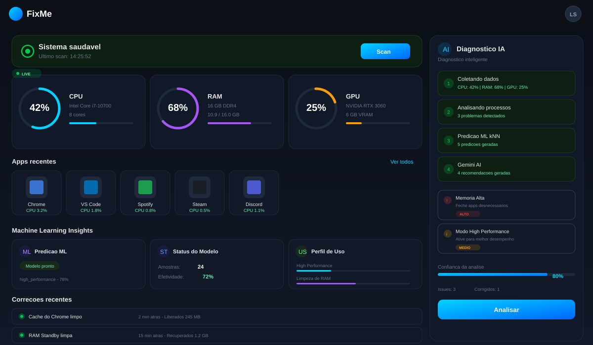
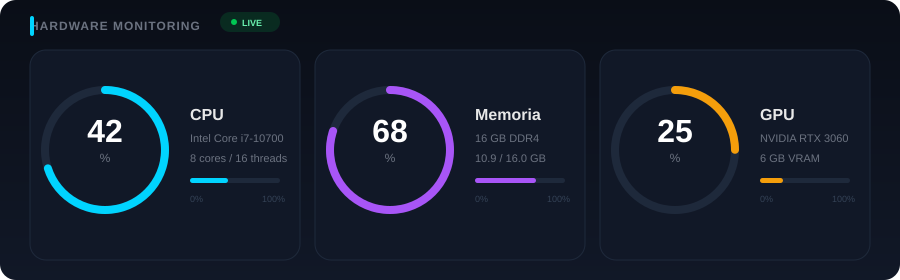
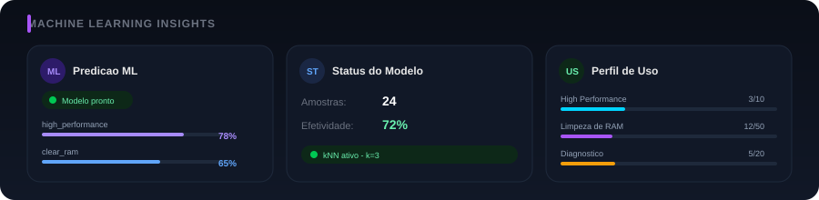
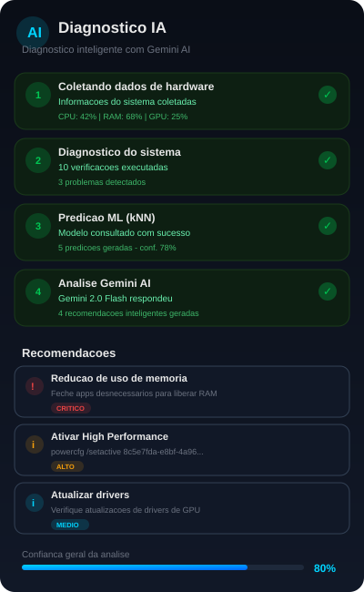
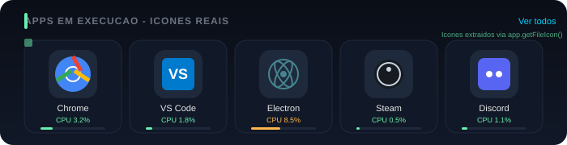
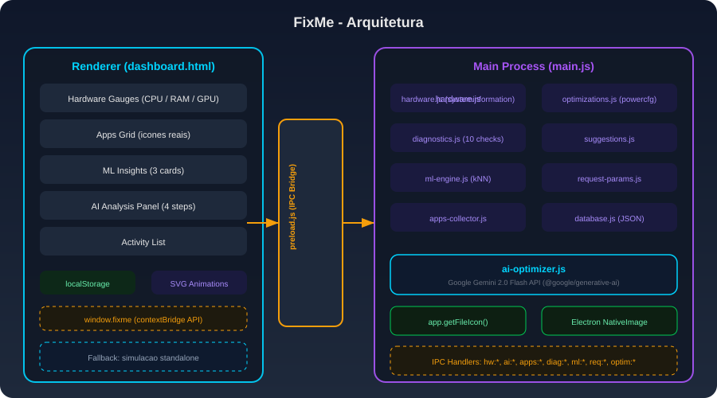

<p align="center">
  
</p>

<h1 align="center">FixMe</h1>

<p align="center">
  <strong>Otimizador de desempenho desktop para Windows 10/11 com foco em jogos</strong><br/>
  Electron · Gemini AI · 5 Modelos ML Locais · Deep AI · Monitoramento em tempo real
</p>

<p align="center">
  
  
  
  
  
  
  <a href="https://github.com/leosan123456/FixMe/releases/latest">
    
  </a>
</p>

---

## Instalacao Rapida

### Uma linha (PowerShell)

```powershell
irm https://raw.githubusercontent.com/leosan123456/FixMe/main/install.ps1 | iex
```

O script baixa automaticamente o instalador da ultima release, solicita UAC e apos instalar oferece configurar a chave Gemini AI.

### Instalacao manual

Baixe o instalador `.exe` diretamente na pagina de [Releases](https://github.com/leosan123456/FixMe/releases/latest) e execute como administrador.

---

## Visao Geral

O **FixMe** e uma aplicacao desktop construida com Electron que monitora, diagnostica e otimiza o desempenho do seu PC Windows em tempo real. Combina coleta de dados de hardware, diagnosticos automatizados, **5 modelos de Machine Learning 100% locais**, Deep AI (Gemini) e otimizacoes profundas do Windows para fornecer recomendacoes personalizadas baseadas no seu historico de uso real.

---

## Dashboard

<p align="center">
  
</p>

Interface moderna com tema escuro exibindo dados em tempo real:

- **Gauges de Hardware** — CPU, RAM e GPU com gauge rings SVG animados
- **Apps em Execucao** — Grid com icones reais dos processos via `app.getFileIcon()`
- **ML Insights** — Cards com predicoes dos 5 modelos locais, perfil de uso e anomalias
- **Painel Deep AI** — Pipeline de 4 etapas com progresso em tempo real e recomendacoes Gemini
- **Correcoes Recentes** — Timeline de otimizacoes aplicadas

---

## Funcionalidades

### 1. Monitoramento de Hardware em Tempo Real

| Metrica | Detalhes |
|---------|----------|
| **CPU** | Uso atual (%), modelo, cores, barra adaptativa |
| **RAM** | Uso atual (%), total/usado em GB |
| **GPU** | Uso atual (%), modelo, VRAM |

- Atualizacao a cada 2 segundos via IPC broadcast (`hw:stats-update`)
- Cores adaptativas: verde (<60%), amarelo (60-80%), vermelho (>80%)
- Cada tick alimenta automaticamente os 5 modelos ML locais

---

### 2. Machine Learning Local — 5 Modelos (sem API)

<p align="center">
  
</p>

Todos os modelos rodam 100% offline, aprendem com o historico real do usuario e persistem via banco local.

| Modelo | Algoritmo | O que aprende |
|--------|-----------|---------------|
| **AnomalyDetector** | Welford online z-score | Detecta CPU/RAM/GPU anormais vs. baseline do usuario |
| **PerformanceForecast** | Exponential smoothing (168 slots hora×dia) | Prevê carga esperada para a proxima hora |
| **UserProfileCluster** | Online k-means (k=4) | Aprende perfil dominante: Gamer / Trabalho / Idle / Misto |
| **SessionClassifier** | Naive Bayes | Classifica sessao atual (gaming, work, idle, media, browser) |
| **OptimizationScorer** | kNN ponderado por recencia (half-life 30 dias) | Prediz qual otimizacao gera maior queda de CPU/RAM/GPU |

**Detalhe do OptimizationScorer:**
- Vetor de 8 dimensoes: `[cpu, mem, gpu, hora, dia, processos, cpuTrend, memTrend]`
- Rastreia delta antes/depois de cada otimizacao aplicada
- Blends de score medido (delta real) + avaliacao do usuario
- Decaimento exponencial temporal — otimizacoes recentes pesam mais

---

### 3. Deep AI (Gemini 2.0 Flash)

<p align="center">
  
</p>

Pipeline de 4 etapas com progresso em tempo real:

| Etapa | Descricao | Modulo |
|-------|-----------|--------|
| **1. Hardware** | CPU, RAM, GPU, processos | `hardware.js` |
| **2. Diagnostico** | 10 verificacoes automatizadas | `diagnostics.js` |
| **3. ML Local** | Predicoes dos 5 modelos locais | `local-ml.js` |
| **4. Gemini AI** | Recomendacoes inteligentes personalizadas | `deep-ai.js` + `ai-optimizer.js` |

- Conversa multi-turn com contexto de sessao
- Fingerprint do sistema: hardware + processos + historico + padroes locais
- Resposta estruturada em JSON com `systemProfile`, `optimizationPlan`, `predictions` e `insights`
- Analise de gargalos por tipo: `cpu`, `memory`, `gpu`, `network`
- Analise da lista de processos: identifica processos seguros de matar, suspeitos e tweaks de prioridade

---

### 4. Otimizacoes Profundas do Windows

| Categoria | Descricao |
|-----------|-----------|
| **Plano de Energia** | Ultimate Performance / High Performance com throttling 100% |
| **Efeitos Visuais** | Desabilita animacoes, sombras, transparencias |
| **Servicos Bloat** | Desabilita 16 servicos desnecessarios (telemetria, Xbox, Fax…) |
| **Telemetria** | Remove coleta de dados Microsoft, CEIP, historico de atividades |
| **Rede** | Desabilita Nagle, habilita RSS/Chimney, ajusta NetworkThrottlingIndex |
| **Scheduler** | MMCSS Games profile: GPU Priority 8, Clock Rate 10000, Scheduling High |
| **Registro** | Remove startup delay, prefetch SSD, tips, maintenance automtica |
| **GPU** | HAGS, Game Mode, GameDVR, fullscreen optimizations, NVIDIA PowerMizer |
| **Memoria** | Clear standby list, working set trim, heap decommit threshold |
| **Processos** | Kill background (OneDrive, Teams, Discord…), boost de prioridade para jogos |

Todas as operacoes privilegiadas passam por UAC via `sudo-prompt` e sao protegidas por rate limiting.

---

### 5. Diagnostico do Sistema (10 Verificacoes)

| # | Verificacao | Severidade |
|---|------------|------------|
| 1 | Windows Updates recentes | HIGH |
| 2 | Espaco em disco (>85% / >95%) | CRITICAL/HIGH |
| 3 | Dispositivos com erro no Device Manager | MEDIUM |
| 4 | Processos suspeitos (malware patterns) | CRITICAL |
| 5 | Temperatura CPU (>75°C / >85°C) | HIGH/MEDIUM |
| 6 | Saude da memoria (>80% / >90%) | HIGH/MEDIUM |
| 7 | Servicos criticos (Defender, WMI) | MEDIUM |
| 8 | Fragmentacao do disco | LOW |
| 9 | Erros RX/TX nas interfaces de rede | MEDIUM |
| 10 | Windows Defender em tempo real | CRITICAL |

---

### 6. Apps em Execucao com Icones Reais

<p align="center">
  
</p>

- Extrai icones reais dos `.exe` via `app.getFileIcon()` convertidos para base64
- Agrupa processos duplicados somando CPU/RAM
- Top 12 apps ordenados por uso de CPU
- Tooltip com caminho completo e metricas

---

### 7. Rate Limiting

| Tipo | Cooldown | Limite Diario |
|------|----------|---------------|
| `high_performance` | 30s | 10/dia |
| `clear_ram` | 15s | 50/dia |
| `process_priority` | 10s | 30/dia |
| `diagnostico` | 60s | 20/dia |
| `game_optimization` | 30s | 10/dia |

---

## Arquitetura

<p align="center">
  
</p>

```
FixMe/
├── main.js                 # Processo principal Electron + todos os IPC handlers
├── preload.js              # Context Bridge (window.fixme.*)
├── dashboard.html          # UI completa + ML inline (renderer)
├── launch.js               # Remove ELECTRON_RUN_AS_NODE antes de spawnar
├── install.ps1             # Instalador via PowerShell one-liner
├── .env.example            # Template de configuracao
├── build/
│   └── icon.ico            # Icone multi-resolucao (256/128/64/48/32/16px)
├── .github/
│   └── workflows/
│       └── release.yml     # CI/CD: build NSIS + GitHub Release automatico
└── src/
    ├── local-ml.js         # 5 modelos ML 100% locais (sem API)
    ├── deep-ai.js          # Deep analysis multi-turn Gemini
    ├── ai-optimizer.js     # Recomendacoes Gemini (lazy init)
    ├── ml-engine.js        # kNN legado (compatibilidade)
    ├── win-optimizer.js    # Otimizacoes profundas Windows (9 categorias)
    ├── hardware.js         # Monitoramento via systeminformation
    ├── optimizations.js    # Otimizacoes basicas (powercfg, priority, RAM)
    ├── diagnostics.js      # 10 verificacoes automatizadas
    ├── suggestions.js      # Engine de sugestoes contextuais
    ├── apps-collector.js   # Coleta apps (recentes, jogos, registro)
    ├── database.js         # Persistencia JSON unica (userData)
    └── request-params.js   # Rate limiting e cooldown
```

### IPC Channels

| Canal | Descricao |
|-------|-----------|
| `hw:get-stats` / `hw:stats-update` | Metricas em tempo real |
| `hw:start-monitoring` / `hw:stop-monitoring` | Controle do loop |
| `ai:full-analysis` / `ai:analysis-progress` | Pipeline Deep AI com progresso |
| `ai:get-smart-recommendations` | Recomendacoes Gemini diretas |
| `ml:predict` / `ml:get-model-stats` / `ml:train-feedback` | kNN legado |
| `localml:tick` | Tick manual dos 5 modelos locais |
| `localml:get-stats` | Estatisticas de todos os 5 modelos |
| `localml:predict` | Predicao do OptimizationScorer |
| `localml:record-outcome` | Registrar resultado antes/depois |
| `localml:train-session` | Rotular sessao manualmente |
| `winopt:full-optimization` | Bundle completo de otimizacoes |
| `winopt:visual-effects` / `winopt:power-plan` / `winopt:gpu` … | Otimizacoes individuais |
| `deepai:analyze` / `deepai:refine` / `deepai:bottleneck` | Deep AI sessions |
| `deepai:analyze-processes` | Analise inteligente da lista de processos |
| `diag:run-diagnostics` / `diag:progress` | Diagnostico com progresso |
| `apps:get-running-with-icons` | Processos + icones reais |
| `optim:set-high-performance` / `optim:clear-standby-list` … | Otimizacoes basicas |

---

## Stack Tecnologica

| Tecnologia | Versao | Uso |
|-----------|--------|-----|
| **Electron** | 28.3.3 | Framework desktop |
| **Node.js** | 18.x | Runtime |
| **systeminformation** | 5.16+ | Dados de hardware |
| **@google/generative-ai** | 0.24+ | SDK Google Gemini |
| **dotenv** | 16.4.7 | Variaveis de ambiente |
| **sudo-prompt** | 9.2.1 | Elevacao UAC |
| **electron-builder** | 26.7+ | Empacotamento NSIS |
| **chart.js** | 3.9.1 | Graficos |

---

## Instalacao para Desenvolvimento

### Pre-requisitos
- Windows 10 ou 11 (64-bit)
- Node.js 18+

```bash
git clone https://github.com/leosan123456/FixMe.git
cd FixMe
npm install
cp .env.example .env
# Edite .env e adicione sua GEMINI_API_KEY
npm start
```

> Obtenha sua chave Gemini gratuitamente em: https://aistudio.google.com/apikey

### Configuracao da chave Gemini pos-instalacao

Crie o arquivo `%APPDATA%\FixMe\.env` com o conteudo:

```env
GEMINI_API_KEY=sua_chave_aqui
```

O app carrega esse arquivo automaticamente. Sem a chave, todas as funcionalidades locais (ML, monitoramento, otimizacoes) continuam funcionando normalmente — apenas as analises Gemini ficam indisponiveis.

### Build

```bash
npm run dist      # Gera instalador NSIS .exe em /dist
npm run pack      # Dir-only (sem installer, mais rapido)
npm run release   # Build + publica no GitHub Releases
```

### CI/CD

Push de qualquer tag `v*.*.*` dispara o workflow `.github/workflows/release.yml` que:
1. Builda o instalador no `windows-latest`
2. Cria automaticamente uma GitHub Release com o `.exe`

```bash
git tag v1.1.0 && git push origin v1.1.0
```

---

## Seguranca

- **Context Isolation** habilitado — renderer sem acesso direto ao Node.js
- **nodeIntegration** desabilitado — tudo passa pelo `preload.js`
- **IPC seguro** via `contextBridge.exposeInMainWorld()`
- **Elevacao UAC** para todas as operacoes de sistema
- **Rate limiting** para prevenir abuso de API e operacoes
- **ML 100% local** — nenhum dado de hardware e enviado para servidores externos

---

## Screenshots

| Dashboard Completo | Gauges de Hardware |
|---|---|
|  |  |

| Analise IA | ML Insights |
|---|---|
|  |  |

| Apps com Icones Reais | Arquitetura |
|---|---|
|  |  |

---

## Licenca

MIT License — veja [LICENSE](LICENSE) para detalhes.

---

<p align="center">
  Feito com Electron · Gemini AI · Machine Learning Local · Windows Optimization
</p>
